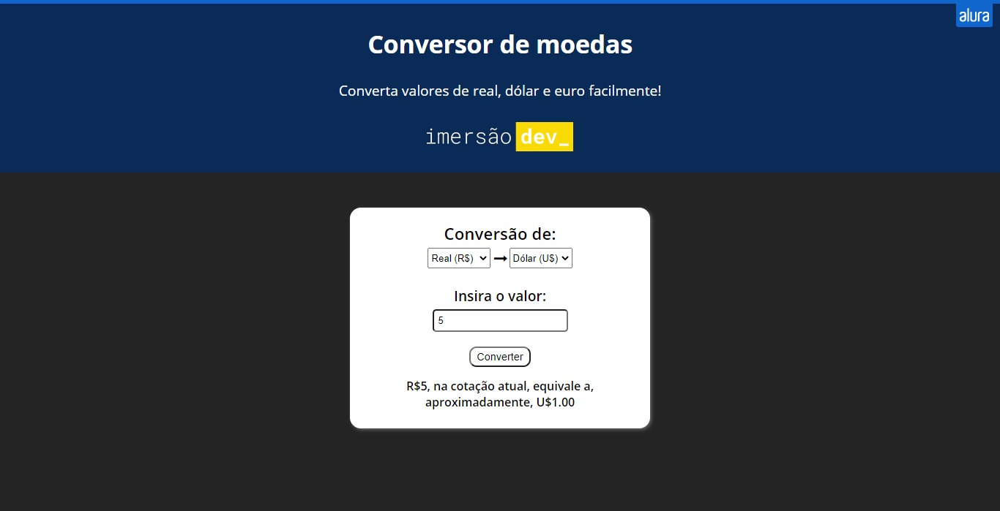

# Conversor de moedas - Imersão Dev

Um conversor de moedas simples feito para a Imersão Dev, da Alura. 

## Conteúdos

- [Overview](#overview)
  - [O projeto](#o-projeto)
  - [Screenshot](#screenshot)
  - [Links](#links)
- [Processo](#processo)
  - [Feito com](#feito-com)

- [Autor](#autor)

## Overview

### O projeto

- Usando HTML, CSS e JavaScript, fazer um site para conversão de moedas, tendo como base [este código](https://codepen.io/imersao-dev/pen/zYNOZRX). Gostei de fazê-lo, porém, é meu projeto "menos preferido" comparado aos outros.

### Screenshot

### Links

- [URL do Site](https://luizhf42.github.io/conversor-de-moedas)

## Processo

### Feito com

- HTML5
- CSS3
- Flexbox
- JavaScript

## Autor

- Propriamente eu, Luiz Henrique.
